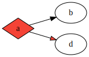

Dot-Lang
========

documentation can be found on [pursuit](https://pursuit.purescript.org/packages/purescript-dotlang/1.1.0/docs/Data.DotLang#t:DotLang)

define your model like this:

```purescript
import Data.DotLang.Attr.Global as Global
import Data.DotLang.Attr.Node
import Data.DotLang.Attr.Edge
import Data.DotLang.Attr
import Data.DotLang.Class (toText)
import Color.Scheme.MaterialDesign (red)


graph = DiGraph
    [ global [ rankDir FromLeft ]
    , node "a" [ shape Node.Diamond, style Filled, fillColor red ]
    , node "b" []
    , "a" ==> "b"
    , "a" =*> "d" $ [ fillColor red ]
    , Subgraph
        [ node "d" []
        ]
    ]
```

can be rendered using `toText` to:

```
digraph {
    rankdir=LR; 
    a [fillcolor="#f44336", shape=diamond, style=filled]; 
    b []; 
    a -> b; 
    a -> d [fillcolor="#f44336"]; 
    subgraph { 
        d []; 
    }
}
```

Which looks like this, when rendered with graphviz:



### Installation

#### Spago

```dhall
let additions = 
    { dotlang = 
        { dependencies = 
            [ "colors"
            , "console"
            , "effect"
            , "generics-rep"
            , "prelude"
            , "psci-support"
            , "strings"
            , "test-unit"
            ]
        , repo = "https://github.com/csicar/purescript-dotlang.git"
        , version = "v2.0.0"
        }
    }
```
```bash
spago install dotlang
```

#### Bower

```bash
bower i purescript-dotlang
```


Changelog
=========

v4.0.0
------

Breaking Changes:

- dotlang now internally represents attributes as a record. To **migrate**:
    - replace calls to Attribute constructors with their lower-case counter-part:
        E.g. `FontColor` with calls to `fontColor`
    - replace calls to `Node`, `Edge` and `Global` with `node`, `edge` and `global`
- to avoid name collisions, `Edge.Diamond :: ArrowHead` was renamed to `Edge.FDiamond`


v3.0.0
------

Breaking Changes:

- `Label` of `Edge` and `Node` now support HTML and no formatting: To **migrate** replace old calls to `Label` with calls to `label`